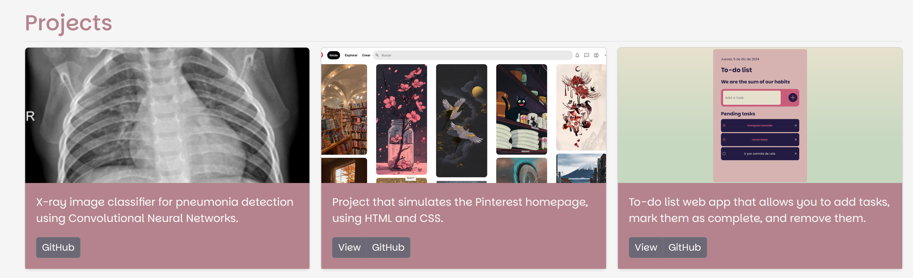

# Project Portfolio
Hi! My name is ***Daryana Martínez-Uribe***, I'm a biomedical engineer who loves software development. You can find my Portfolio in this repository.
___________________________________________________________________________________________

### This project has the following sections:
- 👩‍🔬About me
- ⭐Skills
- 💼Projects
- 🔎Research & Collaborations
- 📜Courses & Certifications
- 📫Contact

### Created with:

  
    
    
### Preview:
https://daryanaur.github.io/ 

_________________________________________________________________________________________
### *I'm looking forward to seeing you soon!* 💌
E-mail: [daryanauribe25@gmail.com](mailto:daryanauribe25@gmail.com)

 
Created at <a target="_blank" href="https://tecnolochicas.mx/">Tecnolochicas Pro</a> BootCamp

         
